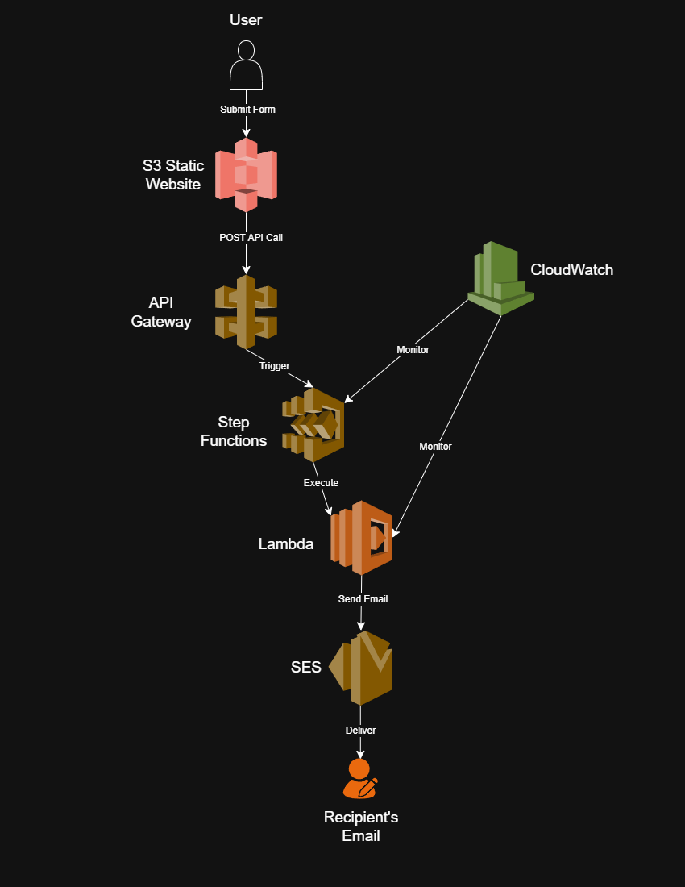
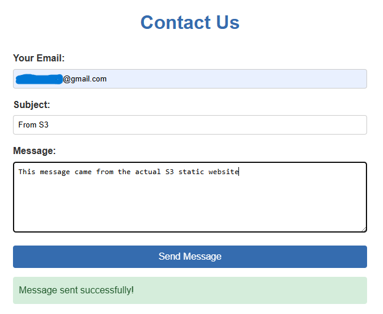
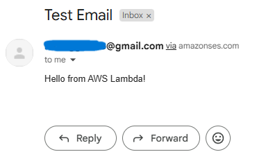
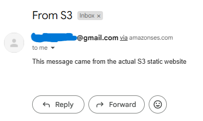

# Scalable Customer Communication System | 99.9% Message Delivery

A fault-tolerant serverless email notification system built with **S3, API Gateway, Lambda, Step Functions, SES, and SNS**. Users submit a contact form (hosted on S3), triggering an API Gateway endpoint that orchestrates email delivery via Step Functions and SES.

[](https://aws.amazon.com)

---

## Objectives
✅ Configure AWS SES
- **Verify sender email**
  
✅ Build Serverless Backend
- **Create Lambda function with SES permissions**
- **Implement Step Functions for fault-tolerant workflows**

✅ Secure API Gateway
- **Deploy REST API with CORS**

✅ Deploy Static Frontend
- **Host on S3 with public access (demo) or CloudFront (production)**
- **Configure CORS for API calls**

---

## 🛠️ Technologies Used
| Service               | Use Case                          |
|-----------------------|-----------------------------------|
| **Amazon S3**         | Host static frontend (HTML/CSS/JS)|
| **API Gateway**       | REST endpoint for form submissions|
| **AWS Lambda**        | Send emails via SES               |
| **Step Functions**    | Orchestrate email workflow        |
| **Amazon SES**        | Email delivery service            |

---

## 🏗Architecture


---

## Steps
1. Configure SES
    - Go to SES → Verify Email Address (confirm via inbox).
2. Create Lambda Function
    - Write Python code to send emails via SES.
    - Attach IAM role with ses:SendEmail and logging permissions.
3. Build Step Functions Workflow
    - Define state machine with retries/error handling.
    - Connect to Lambda.
4. Deploy API Gateway
    - Create REST API with POST method.
    - Enable CORS and redeploy.
5. Host Frontend on S3
    - Upload index.html with API Gateway endpoint.
    - Set bucket policy for public read access (or use CloudFront).
6. Test & Monitor
    - Submit form → Check email delivery.

---

## Visuals
| Results | Image |
|-------------|-------|
| S3 Static Website |  |
| Lambda Test Email |  |
| S3 Static Website Email |  |

---

### **Code Snippets**
#### **Lambda Python Code** (`scripts/LambdaPythonFunction.py`):
```bash
import boto3
import json


ses = boto3.client('ses')


def lambda_handler(event, context):
    try:
        # Validate input
        required_fields = ['email', 'subject', 'message']
        if not all(field in event for field in required_fields):
            raise ValueError("Missing required fields")
            
        response = ses.send_email(
            Source='verified-email@example.com',  # Replace with your SES email
            Destination={'ToAddresses': [event['email']]},
            Message={
                'Subject': {'Data': event['subject']},
                'Body': {'Text': {'Data': event['message']}}
            }
        )
        return {
            'statusCode': 200,
            'body': json.dumps({'message': 'Email sent successfully', 'response': response})
        }
    except Exception as e:
        return {
            'statusCode': 500,
            'body': json.dumps({'error': str(e)})
        }
```

#### **CORS Policy**:
```bash
<CORSConfiguration>
  <CORSRule>
    <AllowedOrigin>https://your-website-bucket.s3-website.REGION.amazonaws.com</AllowedOrigin>
    <AllowedMethod>POST</AllowedMethod>
    <AllowedHeader>*</AllowedHeader>
  </CORSRule>
```

#### **S3 Bucket Policy**:
```bash
{
  "Version": "2012-10-17",
  "Statement": [
    {
      "Effect": "Allow",
      "Principal": "*",
      "Action": "s3:GetObject",
      "Resource": "arn:aws:s3:::your-website-bucket/*"
    }
  ]
}
```


## 🚀 How to Deploy
```bash
# Clone repo
git clone https://github.com/nickjduran15/AWS-SESapp.git
